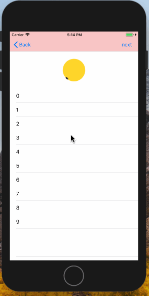

# SFRefreshView
[CRRefresh](https://github.com/CRAnimation/CRRefresh)的 OC版本

上效果图




一行代码添加下拉刷新,上拉加载~

```objc
/// 添加下拉刷新
[self.tableView.refreshWrapper addHeaderRefreshWithHandler:^{
	[self tableViewDidTriggerRefreshType:SFRefreshTypeHeader];
}];
/// 添加上拉加载
[self.tableView.refreshWrapper addFooterRefreshWithhandler:^{
	[self tableViewDidTriggerRefreshType:SFRefreshTypeFooter];
}];

- (void)tableViewDidTriggerRefreshType:(SFRefreshType)refreshType
{
     __weak typeof(self) weakself = self;
    dispatch_after(dispatch_time(DISPATCH_TIME_NOW, (int64_t)(5 * NSEC_PER_SEC)), dispatch_get_main_queue(), ^{
        if (refreshType == SFRefreshTypeHeader) {
            [weakself.dataSource removeAllObjects];
        }
        for (NSInteger i = 0; i < 5; i++) {
            NSString * str = [NSString stringWithFormat:@"%zd",i];
            [weakself.dataSource addObject:str];
        }
        if (refreshType == SFRefreshTypeHeader) {
            [weakself.tableView.refreshWrapper resetNoMoreData];
            [weakself.tableView.refreshWrapper endHeaderRefresh];
        } else {
            if (weakself.dataSource.count >= 20) {
                [weakself.tableView.refreshWrapper endWithNoMoreData];
            } else {
                [weakself.tableView.refreshWrapper endFooterRefresh];
            }
        }
       
        [weakself.tableView reloadData];
    });
}
```

